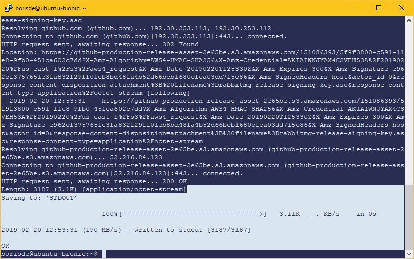
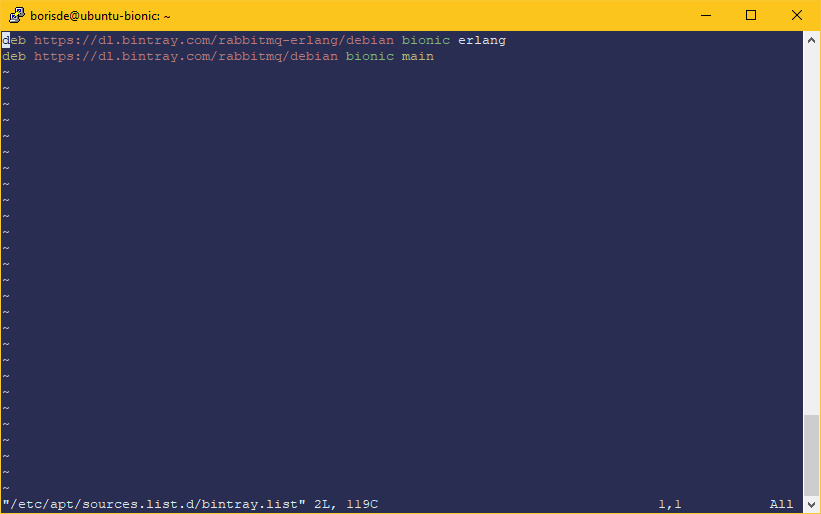
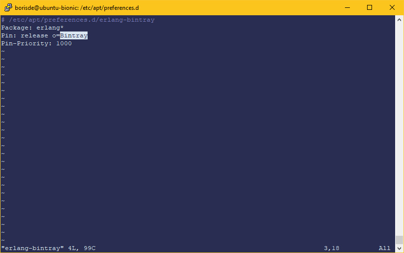
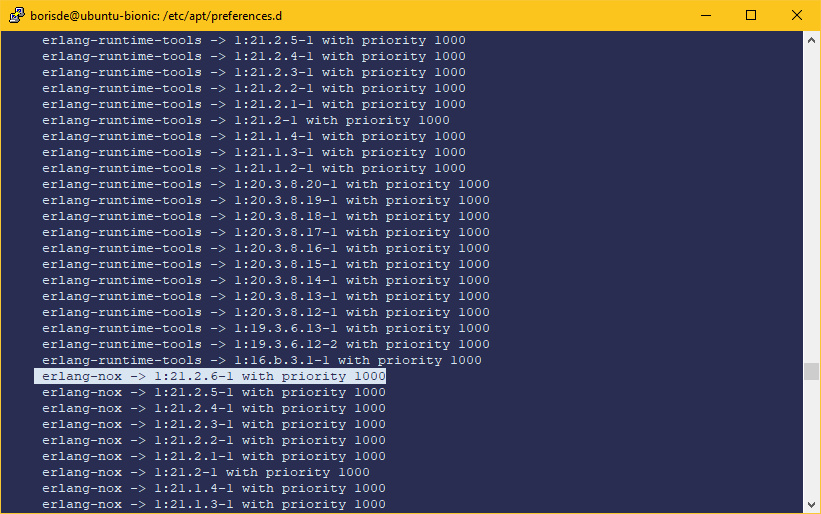
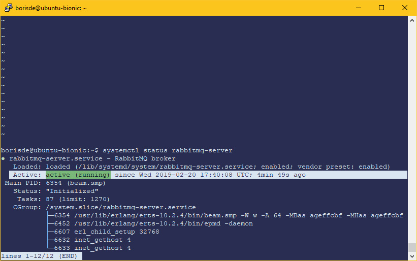
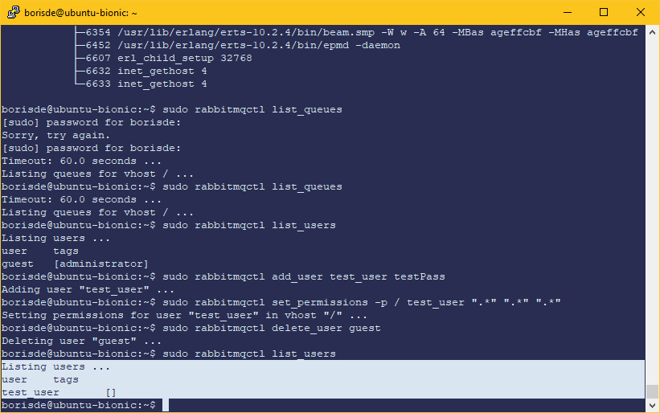
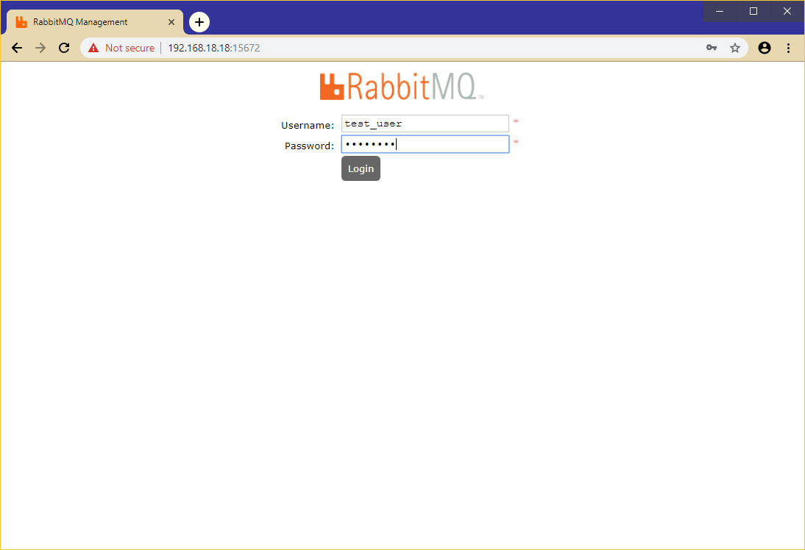
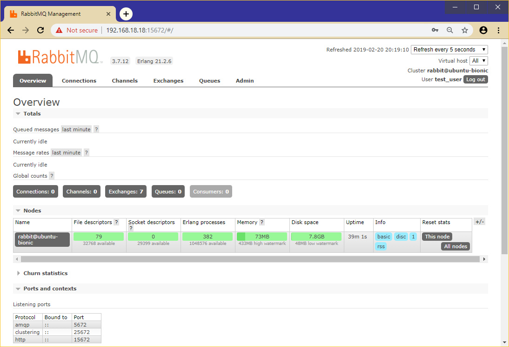

# Установка RabbitMQ на Ubuntu 18 bionic

`rabbitmq-server` включен в стандартный репозиторий Ubuntu, но эта версия будет устаревшей.
Для установки последней доступной версии будем использовать репозиторий [Bintray](https://bintray.com/).
Этот репозиторий поддерживается командой RabbitMQ и в него включены последние версии для разных версий ОС, например `Ubuntu 18.04 (Bionic)`, `Ubuntu 16.04 (Xenial)`, `Debian Stretch`, `Debian Jessie`.

Для работы RabbitMQ также потребуется установить последнюю верию `Erlang`.

Устанавливаем `apt-transport-https`, чтобы была возможность скачивать пакеты с Bintray:

```
sudo apt install apt-transport-https
```

Импортировать ключ подписи RabbitMQ, чтобы `apt` доверял пакетам подписанным этим ключем:

```
wget -O - "https://github.com/rabbitmq/signing-keys/releases/download/2.0/rabbitmq-release-signing-key.asc" | sudo apt-key add -
```





Теперь нужно добавить файл с описанием нового репозитория в `/etc/apt/sources.list.d/`. В этот файл добавим строки с адресами для `Erlang` и `RabbitMQ` следуя такому шаблону:

```
deb https://dl.bintray.com/rabbitmq-erlang/debian $distribution $component
deb https://dl.bintray.com/rabbitmq/debian $distribution $component
```

Где `$distribution` может иметь такие значения:

* `bionic` для Ubuntu 18.04
* `xenial` для Ubuntu 16.04
* `stretch` для Debian Stretch
* `jessie` для Debian Jessie

Переменная `$component` для `rabbitmq-erlang` может иметь такие значения:

* `erlang` - самая актуальная версия 
* `erlang-21.x`, `erlang-20.x`, `erlang-19.x` - предыдущие версии

Аналогично для строки с `rabbitmq`:

* `main` - самая актуальная версия `RabbitMQ`

Итак, создать файл `/etc/apt/sources.list.d/bintray.list` для версии Ubuntu 18.04 можно следующей командой:

```
sudo tee /etc/apt/sources.list.d/bintray.list <<EOF
deb https://dl.bintray.com/rabbitmq-erlang/debian bionic erlang
deb https://dl.bintray.com/rabbitmq/debian bionic main
EOF
```

Для Ubuntu 16.04 команда будет выглядеть так:

```
sudo tee /etc/apt/sources.list.d/bintray.list <<EOF
deb https://dl.bintray.com/rabbitmq-erlang/debian xenial erlang
deb https://dl.bintray.com/rabbitmq/debian xenial main
EOF
```

Проверим:

```
sudo vim /etc/apt/sources.list.d/bintray.list
```




Может случиться такое что `Erlang` будет доступен из нескольких репозиториев, поэтому настроим приоритет для `Bintray` и последней актуальной версиии.
Сделать это можно создав файл с конфигурацией в директории `/etc/apt/preferences.d/`:

```
sudo tee /etc/apt/preferences.d/erlang-bintray <<EOF
# /etc/apt/preferences.d/erlang-bintray
Package: erlang*
Pin: release o=Bintray
Pin-Priority: 1000
EOF
```

Проверяем:

```
sudo apt-cache policy
```




 
Теперь необходимо обновить пакеты:

```
sudo apt update 
```

Наконец установим `Erlang` и `RabbitMQ`: 

```
sudo apt install erlang-nox
```

```
sudo apt-get install rabbitmq-server
```

Проверим установку:

```
systemctl status rabbitmq-server
```




##### Создание нового пользователя RabbitMQ

По умолчанию при установке был создан пользователь `guest` с паролем `guest`.
Создадим нового юзера `test_user` с паролем:

```
sudo rabbitmqctl add_user test_user testPass
```

Сделаем нового юзера администратором и дадим ему все права: 

```
sudo rabbitmqctl set_user_tags test_user administrator
```

```
sudo rabbitmqctl set_permissions -p / test_user ".*" ".*" ".*"
```

Удалим дефолтного юзера:

```
sudo rabbitmqctl delete_user guest
```

Проверим:

```
sudo rabbitmqctl list_users
```



##### Установка панели администрирования для RabbitMQ

Установить плагин админ панели можно командой:

```
sudo rabbitmq-plugins enable rabbitmq_management
```

Панель будет доступна по адресу `<адрес_сервера>:15672`






##### Полезные команды

Добавление нового хоста:

```
sudo rabbitmqctl add_vhost host_name
```

Вывести список очередей:

```
sudo rabbitmqctl list_queues
```

Очистка очереди:

```
sudo rabbitmqctl purge_queue host_name
```

Включение, выключение, перезагрузка, статус:

```
sudo systemctl start rabbitmq-server
sudo systemctl stop rabbitmq-server
sudo systemctl restart rabbitmq-server
sudo systemctl status rabbitmq-server
```