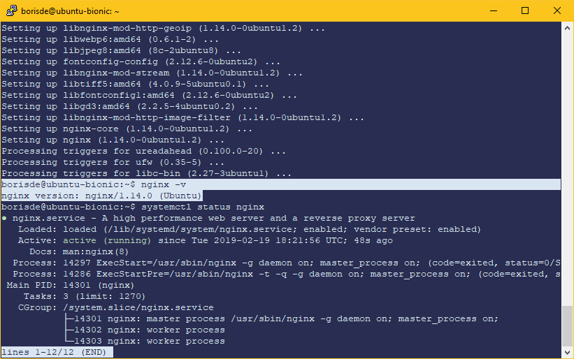
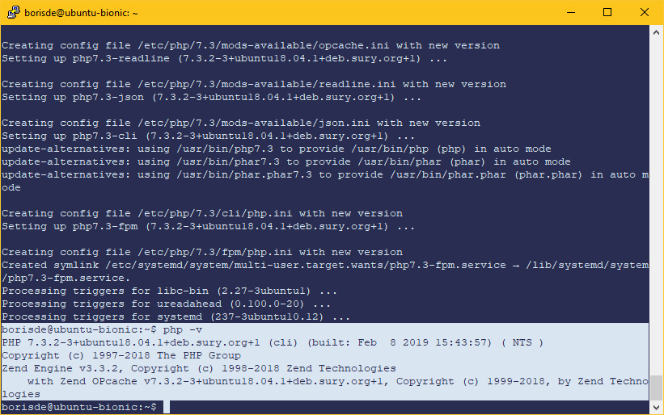
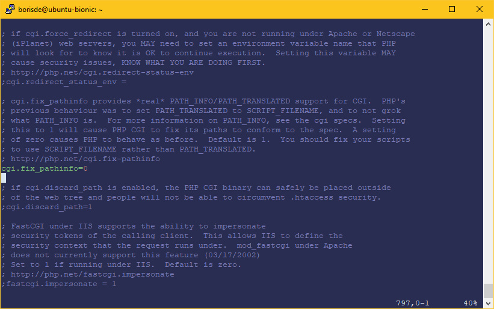
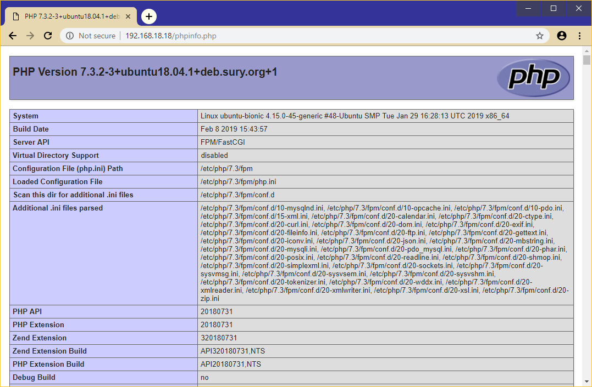
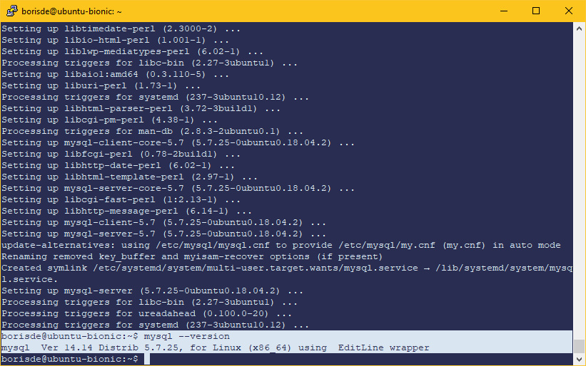
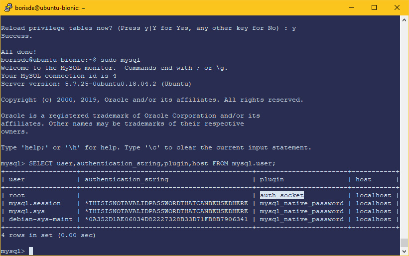
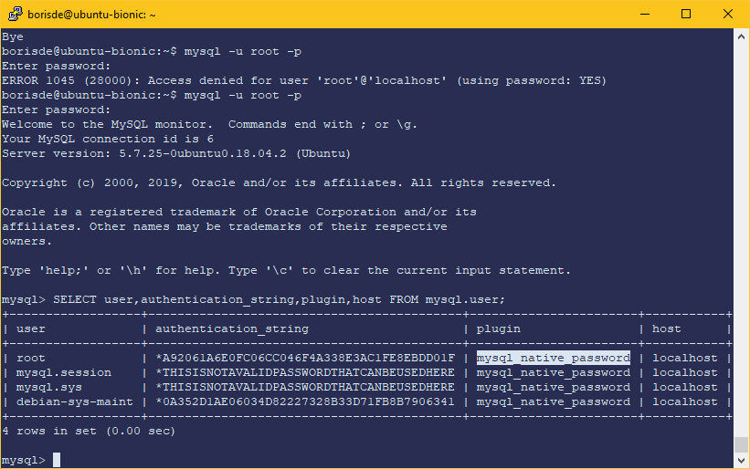

# Шпаргалка по установке Nginx, PHP 7, MySQL на Ubuntu 18 (bionic)

## Обновление пакетов

Приконнектимся к нашему серверу по SSH и обновим список пакетов:

```
sudo apt update
```

Установим текстовый редактор Vim, если еще не установлен:

```
sudo apt install vim
```


## Установка Nginx

```
sudo apt install nginx
```

Проверяем версию и статус nginx:

```
nginx -v
```

```
systemctl status nginx
```

Результат:



```vim
Основные комманды для запуска/остановки/перезапуска сервера:
sudo systemctl start nginx
sudo systemctl stop nginx
sudo systemctl restart nginx 
sudo systemctl enable nginx
```

## Установка PHP 7

Добавим в систему репозиторий с последней версией PHP:

```
sudo add-apt-repository ppa:ondrej/php
```

```
sudo apt update
```

На момент написания мануала последняя версия PHP - 7.3, поэтому установим связку `php-fpm` с помощью команды `php7.*-fpm`, где `*` - нужная версия PHP:

```
sudo apt install php7.3-fpm
```

> Примечание: если выполнить команду `sudo apt install php7.3`, то по умолчанию будет установлен apache c библиотеками для обработки php запросов, 
а команда `php7.3-fpm` устанавливает `php-fpm` без apache.

Проверим версию PHP:

```
php -v
```

Результат:



Установим различные полезные расширения для PHP 7.3:

```
sudo apt install php7.3-cli php7.3-json php7.3-pdo php7.3-mysql php7.3-zip php7.3-mbstring php7.3-curl php7.3-xml 
```

Перезагрузим nginx:

```
sudo systemctl restart nginx
```

Для безопасности нужно раскоментировать строку и установить `cgi.fix_pathinfo=0` в файле конфига PHP `/etc/php/7.3/fpm/php.ini`.

Это можно сделать следующей коммандой:

```
sudo sed -i 's/;cgi.fix_pathinfo=[1|0]/cgi.fix_pathinfo=0/g' /etc/php/7.3/fpm/php.ini
```

```
sudo systemctl restart php7.3-fpm
```




#### Проверка работы PHP

Nginx при установке создал сайт с приветствием, изменим дефолтный конфиг этого сайта для проверки работы PHP 7:

```
sudo vim /etc/nginx/sites-available/default
```

Очистим файл:

```vim
:1,$d <Enter>
```

Включим режим добавления в редакторе Vim:

```vim
a
```

И добавим туда простой nginx конфиг:

```nginxconf
server {
        listen 80 default_server;
        listen [::]:80 default_server;

		#корневая директория где хранятся файлы сайта
        root /var/www/html; 

		#возможные имена индексных файлов
        index index.php index.html index.htm index.nginx-debian.html;

        server_name _;

        location / {
				try_files $uri $uri/ =404;
				
				#сначало проверяем существует ли файл из запроса $uri,
				#если нет, проверяем наличие директории $uri/ 
				#если и директория не существует, то показать ошибку 404
                
        }

        location ~ \.php$ {
				#перенаправление php запросов на обработку php7.3-fpm						    
                fastcgi_pass unix:/var/run/php/php7.3-fpm.sock;
                fastcgi_split_path_info ^(.+\.php)(/.*)$; 
                include fastcgi_params;
                
                fastcgi_param SCRIPT_FILENAME $realpath_root$fastcgi_script_name;
                fastcgi_param DOCUMENT_ROOT $realpath_root;        
        }
}
```

Сохраним файл:

```vim
<Esc> :wq <Enter>
```

Перезапустим nginx:	

```
sudo systemctl restart nginx
```

Файлы сайта с приветствием лежат по адресу `/var/www/html`. Создадим в этой папке `phpinfo.php` для проверки работы PHP 7:

```
sudo vim /var/www/html/phpinfo.php
```

Добавим в файл:

```php
<?php
phpinfo();
```

Введем в браузере <ip_адресс_сервера>/phpinfo.php:



Удалим созданный файл phpinfo.php:

```
sudo rm /var/www/html/phpinfo.php
```

Если дефолтный хост nginx больше не нужен, то лучше его отключить, чтобы не было конфликтов:

```
sudo rm -f /etc/nginx/sites-enabled/default  
```

```
sudo systemctl restart nginx
```


## Установка MySQL

```
sudo apt install mysql-server
```

Проверка версии:

```
mysql --version
```

Результат:



Изменим дефолтные настройки для повышения безопасности MySQL:

```
sudo mysql_secure_installation
```

Во время выполнения нужно ответить на вопросы:

```
Would you like to setup VALIDATE PASSWORD plugin? -- Установить плагин для валидации новых паролей?
Change the root password? -- Изменить пароль для root? (начиная с MySQL 5.7 сначало нужно изменить способ авторизации root пользователя)
Remove anonymous user? -- Удалить анонимного пользователя?
Disallow root login remotely? -- Отключить удаленный доступ для root пользователя? 
Remove test database and access to it? -- Удалить тестовую базу?
Reloade privilege tables now? -- Перезагрузить таблицы доступа?
```


В версии MySQL 5.7 по умолчанию для root пользователя включена аутентификация с помощью плагина `auth_socket`



Этот плагин не требует пароль, он только проверяет что пользователь коннектится через UNIX сокет и имя этого пользователя. 
Это хорошо для безопасности, но если используется phpMyAdmin или другая программа для удаленного доступа необходимо изменить метод аутентификации с `auth_socket` на `mysql_native_password` для `root` пользователя или создать нового пользователя с нужными правами.

#### Изменение метода аутентификации с `auth_socket` на `mysql_native_password` для `root`

```
sudo mysql
```

Команда для проверки текущего метода аутентификации:

```
SELECT user,authentication_string,plugin,host FROM mysql.user;
```

Команда для изменения метода аутентификации и установка пароля:

```
ALTER USER 'root'@'localhost' IDENTIFIED WITH mysql_native_password BY 'TestPassword';
```

```
FLUSH PRIVILEGES;
quit;
```

> Если был установлен плагин для валидации MySQL паролей на предыдущем шаге, то в зависимости от его настроек потребуется создавать более сложные пароли.  

Зайдем в консоль MySQL по паролю и проверим:

```
mysql -u root -p
```

```
SELECT user,authentication_string,plugin,host FROM mysql.user;
```

Результат:




#### Создание нового пользователя MySQL

Заходим в панель MySQL под root'ом. Если включена авторизация по паролю, нужно использовать команду
`mysql -u root -p`, если по плагину `auth_socket`, то достаточно `sudo mysql`

Создаем нового пользователя:

```sql
CREATE USER 'test_user'@'localhost' IDENTIFIED BY 'TestPassword';
```

>`test_user` - логин
>`localhost` - имя хоста
>`TestPassword` - пароль

Создадим тестовую базу:
 
```sql
CREATE DATABASE test;
```

Дадим новому юзеру привилегии на тестовую базу:

```sql
GRANT ALL PRIVILEGES ON test.* TO 'test_user'@'localhost';
```

> `GRANT ALL PRIVILEGES ON *.*` - эта команда дает **все** права на **<имя_базы> . <имя_таблицы>**  

```sql
FLUSH PRIVILEGES;
```

Выходим из панели MySql:

```sql
quit
```

Проверим нового юзера:

```
mysql -u test_user -p
```

```sql
show databases;
```

Результат:


